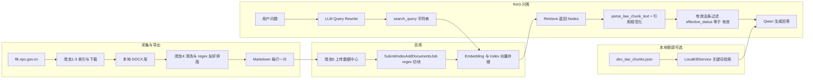

# 知识库填充 / 上传 / 切片 / 入库 / 检索链路审计

**审计日期：** 2026-05-09  
**范围：** `Legal_AI` 仓库内与知识库相关的爬虫导出、百炼上传、RAG 检索与本地联调路径（**未修改任何业务代码**）。  
**说明：** 百炼侧向量维度、Embedding 模型版本、Index 内实际文档条数属于**云端控制台 / 运行时数据**，本仓库无法静态枚举；下文以代码与脚本行为为准。

---

## 1. 当前知识库数据来源

### 1.1 法规数据来自哪里

- **主路径：** 面向「中国人大网」法规公开平台（`flk.npc.gov.cn`）的 **HTTP 拉取 + 解析**。
- **脚本链：** `law_spider/法规爬虫1-建立法规索引、浏览索引.py`（按分类抓取列表与元数据）→ `法规爬虫2-建立下载索引.py` → `法规爬虫3-库下载.py`（下载正文文件到本地「库」目录）→ `法规爬虫4-清洗与知识库导出.py`（从本地 DOCX 抽文本并生成导出 Markdown）→ `法规爬虫5-上传阿里云知识库.py`（上传至百炼并提交建索引任务）。
- **编排入口：** FastAPI `api/kb_update_api.py`（`/kb-update`）可按步骤异步拉起上述子进程；任务状态落在 **`data/kb_update.db`（SQLite）**，**不存放法条向量**。

### 1.2 是否有爬虫

**有。** 法规索引阶段使用 `requests` + `BeautifulSoup` 等抓取网页；下载阶段对官方接口/资源发起请求（含重试与限速逻辑）。性质上属于针对公开法规站的 **定制化采集流水线**，而非通用任意站点爬虫。

### 1.3 是否支持手动上传

- **应用内：** `/kb-update` 是 **任务编排**（指定 `storage_root`、法规类型、步骤），**不是**「用户上传任意文件 → 直接入库」的通用上传接口。
- **实际上传：** `法规爬虫5` 将本地已导出的文件（通常为 **Markdown**）通过百炼 OpenAPI 上传；运维也可在 **阿里云百炼控制台** 另行上传文档（本仓库不强制唯一入口）。
- **结论：** 支持「在约定目录产出导出文件 + 脚本/任务上传」；**无** 独立的「多格式拖拽上传 API」在核心 RAG 路径中描述。

### 1.4 是否支持 PDF / Word / Markdown / JSON / Excel

| 格式 | 在生产链路中的角色 |
|------|-------------------|
| **Word（DOCX）** | **是。** 爬虫下载的正文多为 DOCX，`法规爬虫4` 用 `extract_docx_text` 抽取后再导出。 |
| **Markdown** | **是。** `build_upload_markdown` 输出 `.md`，每行一条切片，供百炼按正则锚点切块。 |
| **PDF** | **部分。** `kb_update_api.CreateJobRequest` 含 `download_pdf`（条约等场景）；法规主链路以索引中的 **格式字段** 为准（常见为 DOCX）。**非** 应用内通用 PDF 解析服务。 |
| **JSON** | **开发联调。** `RAG_BACKEND=local` 时读取 `LOCAL_KB_PATH` 指向的 **JSON 数组**（见 `services/local_kb_service.py`），**不是** 百炼生产入库格式。 |
| **Excel** | **未发现** 作为知识库正文来源的导入逻辑。 |

### 1.5 当前已有多少法规或文档

- **仓库内：** 未包含可统计的「全量已入库法规」清单；`data/dev_law_chunks.json` 在 `.env.example` 中作为示例路径，**工作区快照中未必存在该文件**。
- **线上：** 文档数量 = 百炼工作空间内已上传并成功编入 **Index（`BAILIAN_INDEX_ID`）** 的文件/切片数，需 **控制台或 OpenAPI 查询**。
- **导出侧：** `法规爬虫4` 会为每条下载记录生成一个 `doc_id`（如 `law_{bbbs}`）及一份 Markdown；具体「写了多少文件」取决于当次下载索引行数与本地 DOCX 是否齐全（脚本会统计 `written`、`master_rows` 等，见该脚本 `main`）。

---

## 2. 当前入库流程

### 2.1 文件从哪里进入

1. **本地库目录：** `法规爬虫3` 将文件保存为形如 `{序号}.{标题}.docx` 的结构（与下载索引对应）。
2. **导出目录：** `法规爬虫4` 读取索引元数据 + 本地 DOCX，写出 **按法规类型分类的 Markdown**（文件名含标题、公布日期、`bbbs` 等），并可写 **JSONL 主表** 供追溯。
3. **百炼：** `法规爬虫5` 对导出目录中的文件申请上传租约、上传至数据中心，并在配置 `index_id` 时调用 **SubmitIndexAddDocumentsJob** 将文件纳入知识库索引。

### 2.2 如何解析

- **离线：** DOCX → 纯文本 → `clean_text_for_kb` → `format_for_regex_chunking`（合并断行「第…条」、按章/节/条整理行结构）。
- **云端：** 上传时可配置 `BAILIAN_PARSER`（脚本默认倾向 **`DASHSCOPE_DOCMIND`** 一类文档解析能力，以 `.env` 为准）；**应用运行时** 不对上传文件再做解析。

### 2.3 如何切片

- **第一层（导出）：** `render_kb_lines` 将正文切成 **单行一条** 的知识片段，格式为：  
  `【来源信息】… 【章节】… 【法规正文】…`（无章节时可能省略【章节】）。  
  来源信息行由 `build_source_info_line` 生成：`法规名 | 类型 | 时效性 | 公布日期 | 生效日期 | 链接：detail_url`。
- **第二层（百炼索引）：** `法规爬虫5` 默认 `chunk_mode=regex`，分隔正则多为 **`(?=【来源信息】)`**，使每条导出切片在索引侧与「来源信息锚点」对齐；`chunk_size` / `overlap` 可通过环境变量传入 SDK 请求。

### 2.4 如何生成 embedding

**不在本仓库应用代码中实现。** 由 **阿里云百炼 / Model Studio 知识库** 在索引构建阶段对切片做向量化；`services/aliyun_kb_service.py` 仅调用 **Retrieve** 消费已有索引。

### 2.5 如何写入向量库

- **生产：** 百炼 **Index**（`BAILIAN_WORKSPACE_ID` + `BAILIAN_INDEX_ID`）。
- **非本仓库组件：** 未使用 Milvus、FAISS、Chroma 等作为运行时向量库；**无** 应用内自管向量存储。

### 2.6 是否写入 SQLite / JSON / Milvus / FAISS / Chroma / 阿里云知识库

| 存储 | 是否用于「法条向量」 |
|------|----------------------|
| **SQLite** | **否（向量）。** `kb_update.db` 仅 KB 更新任务；另有聊天相关 SQLite（如 `data/legal_ai_chat.db`）与知识库正文无关。 |
| **JSON** | **仅本地测试。** `LocalKBService` 读取 JSON 数组。 |
| **Milvus / FAISS / Chroma** | **未使用。** |
| **阿里云知识库（百炼 Index）** | **是（生产默认）。** |

---

## 3. 当前切片字段

### 3.1 导出文件单行（逻辑切片）内含

由 `render_kb_lines` / `build_source_info_line` 可还原为下列信息（均挤在单行文本中，靠标签分隔）：

| 逻辑字段 | 说明 |
|----------|------|
| 法规名 | `法规名：` |
| 类型 | `类型：`（`law_nature`） |
| 时效性 | `时效性：`（规范化：尚未生效 / 有效 / 已修改 / 已废止） |
| 公布日期 | `公布日期：` |
| 生效日期 | `生效日期：` |
| 链接 | `链接：`（`detail_url`，法规详情页） |
| 章节 | `【章节】`：当前章/节 + 条号，或序言等 |
| 正文 | `【法规正文】`：该条正文或兜底段落 |

**未在导出模板中单独提供：** `keywords`、`category`（除类型/性质外）、条号独立字段（条号目前编进「章节」字符串）、`source_url_clean`。

### 3.2 检索后标准化引用（`AliyunKBService._node_to_citation`）

从百炼返回的 `Text` + `Metadata` 解析后，应用侧统一为：

| 字段 | 来源要点 |
|------|----------|
| `ref_id` | 展示用 `[n]` |
| `law_name` | Metadata 强键优先，其次正文解析，再弱键 |
| `law_type` | Metadata 或正文解析 |
| `effective_status` | Metadata 或正文解析 |
| `publish_date` | Metadata 或正文解析 |
| `effective_date` | Metadata 或正文解析 |
| `chapter` | Metadata 或 `parse_law_chunk_text` 的【章节】 |
| `article` | `extract_article_number(chapter, text)`（正则抽「第…条」） |
| `text` | 优先解析出的【法规正文】 |
| `source_url` | Metadata 的 url 类键，或正文解析的链接值 |
| `score` | 节点 Score |
| `status` / `status_display` | 由时效性映射（见 `effective_status_to_status`） |
| `doc_id` | Metadata 中 `doc_id` / `nid` / `_id` |

纯文本解析规则见 `services/law_chunk_parse.py`（`【来源信息】` 到 `【章节】`/`【法规正文】` 的结构）。

### 3.3 本地 JSON 切片（`LocalKBService`）

期望对象字段与引用侧对齐：`law_name`, `law_type`, `effective_status`, `publish_date`, `effective_date`, `chapter`, `article`, `text`, `source_url`, `score`, `ref_id` 等（见 `_chunk_to_citation`）。

---

## 4. 当前检索逻辑

### 4.1 用户问题如何改写

- **服务：** `new_feature_qwen_kb/service.py` 中 `QwenKBRagService` 在检索前调用 **`ReasoningService.generate`**，使用 `LEGAL_QUERY_REWRITE_SYSTEM_PROMPT` 与 `LEGAL_QUERY_REWRITE_USER_PROMPT_TEMPLATE`（`config/legal_prompts.py`）。
- **输出：** 要求模型产出 JSON，含 `retrieval_query` / `search_query`（对齐后二者一致）、`standalone_question`、`core_keywords`、`legal_concepts`、`possible_law_names`、`possible_articles`、`required_filters`（示例含 `effective_status: "有效"`）等。
- **失败：** 解析或调用失败时 **回退为原始用户问题** 作为检索查询。

### 4.2 用哪些关键词检索

- **百炼路径：** `AliyunKBService.retrieve` 仅向 Retrieve API 传入 **单一字符串 `query`**（即改写后的 `retrieval_query` 或原问题）。**未** 将 `core_keywords` 数组作为独立检索通道传入 SDK。
- **本地路径：** `LocalKBService` 将查询按空白切分为 **token**，在 `law_name`、`chapter`、`article`、`text` 上做 **子串命中计数**。

### 4.3 检索 top_k 是多少

- **百炼：** `RetrieveRequest` 在代码中 **未设置** 显式 `top_k` 类参数；实际返回节点数由 **云端默认与 Index 配置** 决定。
- **应用侧截取：** `BAILIAN_RERANK_TOP_N`（默认 **6**）控制 `_format_context` 中取前 **最多 6 个** 节点拼装上下文与引用列表（见 `AliyunKBService`）。

### 4.4 如何过滤有效法条

- **百炼 Retrieve：** `retrieve_index` 调用时 **`search_filters` 为 `None`**，不在检索阶段按「有效」过滤。
- **检索之后：** `QwenKBRagService` 使用 `_filter_effective_citations`，仅保留 **`effective_status` 字符串精确等于 `"有效"`** 的引用；否则整轮回答可走「无法条可用」分支（见 `_is_effective_citation`）。
- **本地 KB：** `_effective_chunks` 同样只保留 `effective_status == "有效"` 的切片，再排序。

### 4.5 如何排序

- **百炼：** 节点顺序依赖 **Retrieve API 返回顺序**（通常含相关性 / 重排；本仓库未二次排序）。
- **本地：** 若有 token 命中，则按 **命中数降序、score 降序、原顺序**；若无命中，按 **score 降序** 取少量兜底。

### 4.6 是否支持法规名称、条号、章节精准匹配

- **百炼：** **无** 应用层「法规名 + 条号」结构化精确查询；依赖 **语义检索 + 单字符串 query**。
- **本地：** 仅 **子串匹配**，非司法级精确键控检索。

---

## 5. 当前问题（数据与链路风险）

### 5.1 `source_url` 是否可能混入章节文字

- **设计意图：** 导出时链接为 `链接：{detail_url}`，`parse_law_chunk_text` 将 `链接` 映射为 `source_url`。
- **风险：** 若百炼返回的 `Metadata` 中 url 类字段异常、或正文被截断/拼接导致 `【来源信息】` 解析错位，**可能出现** URL 与正文混排；另见仓库内 `docs/source-url-normalization-audit.md` 对 **空格、零宽字符、流式与终态不一致** 的讨论。

### 5.2 法规名称缺失或异常

- **缓解：** `AliyunKBService` 对 `law_name` 有多级清洗与 `_LAW_NAME_INVALID_EXACT` 过滤，避免「【章节】」等污染。
- **残留风险：** 元数据缺失且正文不符合模板时，仍可能落为 **「未提供」**（`MISSING`）。

### 5.3 条号是否重复

- **导出层：** 每条「第…条」原则上单独成行，但 **无全局去重**；同一法规若重复导出或合并错误，可能产生重复条号切片。
- **引用层：** `article` 由正则从单条切片抽取，**不解决** 跨切片重复。

### 5.4 章节/条文是否重复

- **可能。** 依赖 `format_for_regex_chunking` 与 `render_kb_lines` 对原文结构的识别；异常 DOCX 结构可能导致 **兜底分支** 把多段正文放在同一章节上下文下重复或切块边界模糊。

### 5.5 法规级 URL 与条文级引用

- **当前：** `detail_url` 为 **法规详情页**（`flk.npc.gov.cn/detail?id=...`），**非** 精确到「第 X 条」的锚点 URL；条文定位靠 **章节字符串 + 正文**。

### 5.6 过期法条过滤

- **检索阶段：** 百炼侧 **未** 按「有效」过滤（代码未传 `search_filters`）。
- **生成阶段：** 仅 **`effective_status == "有效"`** 的引用进入最终回答上下文；`已废止`/`已修改` 等仍可能被召回，但在引用过滤阶段被剔除 —— 若模型在过滤前已看到上下文外的节点，需结合具体实现版本确认（当前路径在 **无 kb_context** 或 **过滤后为空** 时有明确降级回答）。

---

## 6. 推荐下一步知识库填充方案

1. **先补哪些法规：** 优先业务高频领域（合同、劳动、公司、侵权责任、诉讼程序等）及**现行有效**且已在 `flk.npc.gov.cn` 有稳定 DOCX 源的文本；对已废止条文单独建 **历史库** 或标签，避免与「仅有效」回答策略冲突。
2. **数据格式建议：** 延续「**单行一片 + 三标签**」以降低与现有 `regex` 切块及 `parse_law_chunk_text` 的耦合；在来源信息中 **固定键名**（与 `_LABEL_TO_FIELD` 一致），避免别名导致解析失败。
3. **标准化导入模板：** **建议** 提供内部 CSV/JSON Schema（法规级 + 条文级字段），由导出脚本生成 `.md` 前做校验（条号、日期、时效性枚举、URL 格式）。
4. **法规级表 + 条文级表：** **建议** 在 **业务库（非向量）** 维护：法规主表（`bbbs`、标题、时效、公布/施行日期、detail_url）；条文表（`law_id`、条号、章节路径、正文 hash、向量切片 id）。向量库只存 **可检索文本**，结构化字段用于过滤与引用展示。
5. **字段扩展：** 可考虑 `source_url_clean`（规范化 URL）、显式 `article_no`（与 `chapter` 解耦）、`law_text` 与 `context_prefix` 分离等，以减少解析歧义并支持精确过滤；百炼 Metadata 若可写，应与导出字段 **同源**，避免 Text 与 Metadata 不一致。

---

## 输出汇总

### 1. 当前知识库链路图（Mermaid）

### 2. 当前字段结构（简表）

- **导出单行：** 来源信息（法规名、类型、时效性、公布/生效日期、链接）+ 可选【章节】+【法规正文】。  
- **应用引用：** `law_name`, `law_type`, `effective_status`, `publish_date`, `effective_date`, `chapter`, `article`, `text`, `source_url`, `score`, `status`, `doc_id`, `ref_id` 等。

### 3. 当前最影响回答质量的问题（优先级主观排序）

1. **检索与过滤脱节：** 百炼可能召回非「有效」条文，全靠后验字符串过滤，易造成 **上下文噪声或过滤后无引用**。  
2. **单查询语义检索：** 复杂问法依赖改写质量，**无** 结构化法规/条号检索，法条定位不稳定。  
3. **法规级 URL 无法精确定位条文**，用户「查看原文」体验依赖站内容器行为（参见既有 `source-url` 审计文档）。  
4. **导出与 DOCX 结构强耦合**，异常排版会导致章节/条边界错误，进而 **条号与正文错配**。

### 4. 推荐分几步修改（仅规划，本次未改代码）

1. **指标与清单：** 在百炼控制台统计 Index 文档数、抽样检索质量；建立「应覆盖法规」清单与版本日期。  
2. **数据层：** 引入法规主表 + 条文表（SQLite 或其它），与 `bbbs`、条号、时效性对齐。  
3. **导出：** 固化模板与校验；可选显式 `article_no`、`source_url_clean`。  
4. **检索：** 评估百炼 `search_filters` / 标签是否与 `effective_status` 对齐；探索 **hybrid**（关键词条号 + 向量）或二次重排。  
5. **产品：** 条文级锚点或官方稳定引用格式，减少 URL 与展示不一致投诉。

---

## 附：命令执行情况

在 `Legal_AI` 目录执行：

`python -m compileall api config services new_feature_qwen_kb`

**结果：** 退出码 **0**，上述包目录列表成功（语法编译检查通过）。
