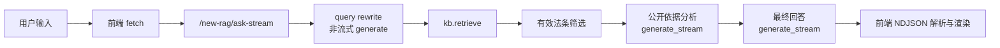

# new-rag 性能与耗时审计报告

> **审计范围**：仅阅读代码与运行静态检查，**未修改业务逻辑**。  
> **生成日期**：2026-05-05  
> **依据代码**：`new_feature_qwen_kb/service.py`、`config/dashscope_config.py`、`services/reasoning_service.py`、`services/local_kb_service.py`、`services/aliyun_kb_service.py`、`frontend/src/app/new-feature-chat/page.tsx` 及相关组件。

---

## 1. 当前问答链路

一次 **`POST /new-rag/ask-stream`**（NDJSON 流）在**有效法条命中**的典型路径如下（与 `QwenKBRagService.ask_events` 一致）：



文字版：

用户输入 → 前端 `fetch` → **`/new-rag/ask-stream`** → **query rewrite**（`ReasoningService.generate`）→ **知识库检索**（`kb.retrieve`）→ **有效法条筛选**（内存过滤 + 重编号）→ **公开依据分析**（`generate_stream`）→ **最终回答生成**（`generate_stream`）→ 前端按行解析 NDJSON、`processEvents` / `answer_delta` 更新 UI。

**分支说明**：

- 若检索结果为空或筛后无有效法条：链路**不调用**公开依据分析与正式回答的流式生成，直接推送带固定文案的 **`answer`** 事件后结束（中间仍会 emit `answer_generation_start` 等，见代码）。
- 非流式 **`POST /new-rag/ask`**（`ask()`）**不包含**「公开依据分析」阶段，仅有 query rewrite + 检索 + 单次非流式回答生成（共 **2 次**模型 completion）。

---

## 2. 当前模型调用次数

以下针对 **`ask-stream` 且命中有效法条** 的「完整」一次问答。

| 阶段 | 调用方式 | System / User 提示来源 | 模型名来源 | 是否流式 | 是否阻塞用户看到「正式回答」流式预览 |
|------|-----------|-------------------------|------------|----------|--------------------------------------|
| **query rewrite** | `ReasoningService.generate` → `create_chat_completion` | `LEGAL_QUERY_REWRITE_SYSTEM_PROMPT` + `LEGAL_QUERY_REWRITE_USER_PROMPT_TEMPLATE`（用户问题） | `get_configured_chat_model()`（`MODEL_BACKEND=ollama` 时为 `LOCAL_MODEL_NAME` 或默认 `qwen2.5:7b`；否则 `NEW_QWEN_MODEL_NAME` / `REASONING_MODEL_NAME` / 默认 `qwen-plus`） | **否**（完整 JSON 一次性返回） | **是**：首个 NDJSON 事件在 rewrite **结束之后**才发出 |
| **public analysis** | `ReasoningService.generate_stream` → `create_chat_completion_stream` | `LEGAL_PUBLIC_ANALYSIS_SYSTEM_PROMPT` + `LEGAL_PUBLIC_ANALYSIS_USER_PROMPT_TEMPLATE`（问题、检索信息、`ref_lines`、有效切片正文） | 同上 | **是** | **不阻塞分析阶段展示**：`analysis_delta` 可逐字展示；但 **阻塞正式回答**：分析流 **全部完成后** 才开始 `answer_generation_start` / `answer_delta` |
| **final answer** | `generate_stream` | `LEGAL_RAG_ANSWER_SYSTEM_PROMPT` + `LEGAL_RAG_ANSWER_USER_PROMPT_TEMPLATE`（检索信息、切片、引用清单、问题） | 同上 | **是** | 用户通过 **`StreamingAnswerDraft`** 看 `answer_delta`（仅在 `answer_generation_start` 之后、收到 `answer` 之前） |

**小结**：一次完整 **`ask-stream`** 最多 **3 次**模型调用（1 次非流式 + 2 次流式会话）。  
**`/new-rag/ask`** 非流式接口为 **2 次**（无公开依据分析）。

---

## 3. 可能的耗时点

| 阶段 | 可能耗时原因 | 当前是否串行 | 是否必须（产品/合规视角） | 可优化方式（思路级，不改代码） |
|------|----------------|--------------|---------------------------|--------------------------------|
| 前端 → 后端 | `NEXT_PUBLIC_API_BASE_URL` 跨域/错误主机、TLS、代理 | 与后端串行 | 必须（要有请求） | 对齐前后端地址；生产同源或正确网关 |
| **query rewrite** | 非流式 completion；Ollama 本地 CPU/GPU；DashScope 网络 RTT | **与后续步骤串行** | **非绝对必须**：失败时可回退原始问题检索（代码已支持）；跳过改写可减一次 RTT（需产品开关） | 可选跳过或缓存相似问题改写结果；缩短 JSON 字段 |
| **kb.retrieve** | **百炼**：OpenAPI 检索 + `asyncio.to_thread`，默认超时约 25s + 等待边界；**本地 JSON**：一次性加载 + 关键词打分（启动时已载入） | 串行 | 必须（RAG 核心） | 百炼侧索引/配额；本地库减小体积；缓存检索结果（注意时效） |
| **有效法条筛选** | 列表过滤与字符串拼装 | 串行，通常毫秒级 | 与 prompt 规则一致（仅「有效」） | 一般不是瓶颈 |
| **公开依据分析** | **整段流式完成后**才开始最终回答；两阶段共用模型时 **总 tokens × 2** 量级 | **与分析→回答强串行** | **功能上非最低限度**：用于可读性与透明；合规上取决于你是否必须展示「依据分析」 | 改为可选、折叠后加载、或先发回答再异步分析 |
| **最终回答** | 长 system prompt + 多段结构强制输出；流式首 token 延迟 | 在分析结束后串行 | 必须（主答案） | 压缩 prompt；换更强/更快模型；DashScope 线上与流式能力验证 |

**重点分析（结合代码）**

- **query rewrite 是否必须**：检索质量依赖 `search_query`；代码在解析失败时用原问题回退，故「改写」可增强召回但非绝对。**并非**唯一正确策略。
- **public analysis 是否必须**：`ask_events` 中在有效法条路径上 **始终执行**；`ask()` 无此步。若仅要答案，分析阶段是 **额外成本**。
- **final answer 是否必须**：是主交付物。
- **是否可减少模型调用**：可探讨「跳过 rewrite」「跳过/延迟 analysis」「rewrite 与检索并行（需接受首次检索用原问）」等，均有取舍。
- **analysis 是否可选 / 先回答再分析 / 仅展开时生成**：当前实现 **不允许**（分析完成后才 `answer_generation_start`）；均为可行产品方向，需改代码与事件顺序。
- **是否可以只在用户展开时生成分析**：当前未实现；Timeline 有折叠 UI，但分析仍在后端预先完整生成。

---

## 4. ask-stream 当前首屏体验

后端 **`ask_events`** 在有效法条路径下的事件顺序为：

1. `query_rewrite_done`（`type`: **progress**）
2. `kb_retrieve_done`（`type`: **retrieval**）
3. `effective_filter_done`（`type`: **retrieval**）
4. `analysis_start`（**progress**）
5. 多条 `analysis_delta`（**analysis_delta**）
6. `analysis_done`（`type`: **analysis**，`stage`: **analysis_done**）
7. `answer_generation_start`（**progress**）
8. 多条 `answer_delta`（**answer_delta**）
9. `answer`（`type`: **answer**，`stage`: **answer_generation_done**）
10. `done`

**用户第一次看到「有价值」内容的时机**：

1. **首个 NDJSON 行**：在 **query rewrite 完成以后**，事件为 **`query_rewrite_done`**。此前前端仅显示「正在连接流式服务…」（`streamingEvents.length === 0`）。  
   → **首个事件的延迟 ≈ 首次模型调用（rewrite）耗时**，而非点击发送瞬间。
2. **检索维度**：**`kb_retrieve_done`** 带来命中条数与引用摘要列表，信息价值高。
3. **分析正文**：首条 **`analysis_delta`** 起，`ProcessTimeline` 内「依据分析」区域开始出现流式文字。
4. **正式回答预览**：仅在收到 **`answer_generation_start`** 后，`StreamingAnswerDraft` 才展示 **`answer_delta`**；此前正式回答区域不显示流式预览。

**关键体验结论**：**正式回答的首 token 必须等待：rewrite + 检索 + 筛选 + 整段依据分析流结束**，这是感知「慢」的主要结构性原因之一。

---

## 5. 本地 Ollama 性能风险

- **`qwen2.5:7b` 本地**：`create_chat_completion` / `create_chat_completion_stream` 走 Ollama OpenAI 兼容接口；7B 在消费级硬件上 **prefill 与 decode 延迟** 往往明显高于云端大模型，且 **同一模型串行执行 rewrite → analysis → answer** 会叠加。
- **`qwen2.5:1.5b`**：通常 **延迟更低、吞吐更高**，但对长 prompt（法学约束 + 长引用块）的 **遵循能力与稳定性** 可能下降，需业务评测。
- **`MODEL_BACKEND=ollama`**：仅代表「推理在本机」；**不能代表**生产环境延迟。
- **`MODEL_BACKEND=dashscope`**：非流式走 **`responses.create`**，流式走 **`chat.completions` 流式**（与非流式路径 **不一致**，见 `dashscope_config.py` 注释）。正式环境可能 **更快**，但受 **网络、地域、配额、模型是否支持兼容流式** 影响；需 **真实账号压测**。

---

## 6. 前端渲染是否可能造成卡顿

**`new-feature-chat/page.tsx`**

- 每收到一行 NDJSON：`pushEvent` 内 **`setStreamingEvents([...streamed])`**，即 **每个事件一次 state 更新**。
- **`streamingAnswerDraft`**：`useMemo` 在 **`streamingEvents` 任意变化时** 遍历 **全部事件** 拼接 `answer_delta`，复杂度随事件数线性增长。
- **`answer` 到达时**：`setMessages` 追加助手消息，并对 `processEvents` 做 **过滤快照**（去掉 `done`/`error`/`answer`/`answer_delta`），随后 **`finally` 清空 `streamingEvents`**。

**`ProcessTimeline.tsx`**

- 多个 `useMemo` 依赖 **`events`**；每次事件追加都会重算过滤列表、citation 摘要等。
- **`useLayoutEffect`** 在 **`events` 变化时** 尝试自动滚动到底部，可能触发 **layout**；事件极密集时有一定开销。
- **`AnalysisBody`**：对 **全部 `events`** 扫描拼接 `analysis_delta`，与上一段类似。

**`StreamingAnswerDraft.tsx`**

- **`useLayoutEffect` 依赖 `text`**：每次回答增量更新可能触发滚动测量。

**`QwenKbAnswerCard.tsx`**

- 最终卡片 **`renderTextWithCitations`** 将正文按 `[n]` 拆分，引用较多时节点数上升；一般在完成后单次渲染，通常不如流式阶段频繁。

**结论**：流式阶段 **高频 `setState` + 全量扫描 `streamingEvents` 拼接 delta**，在 token 极多时可能造成 **主线程压力**；可考虑节流/batching（属建议，本次未改代码）。

---

## 7. 推荐优化方案（不改代码，仅优先级）

| 优先级 | 建议 |
|--------|------|
| **P0** | **只加耗时日志**（各阶段 wall-clock、首字节时间）：先量化 rewrite / retrieve / analysis TTFT / answer TTFT。 |
| **P1** | **减少模型调用**：例如本地调试用「跳过 query rewrite」类开关（当前仓库 **未见** `SKIP_QUERY_REWRITE` 环境变量实现，若引入需开发）；或缩短改写 prompt。 |
| **P2** | **公开依据分析改为可选或延迟**：先流式回答，再异步分析；或默认折叠且按需请求。 |
| **P3** | **前端 delta 更新节流**：`streamingEvents` 批量合并更新或仅保留必要字段，避免每 token 全列表拷贝。 |
| **P4** | **正式环境验证 DashScope**：同问题对比 `MODEL_BACKEND`、模型名、流式是否可用与端到端耗时。 |
| **P5** | **缓存 query rewrite 或检索结果**：注意失效策略与多租户隔离。 |

---

## 8. 建议新增哪些计时点

后续若允许改代码，建议在以下位置记录 **单调时钟时间戳**（或结构化日志）：

| 计时点 | 含义 |
|--------|------|
| `request_start` | 路由收到请求 / `ask_events` 入口 |
| `query_rewrite_start` / `query_rewrite_end` | 包裹 `reasoning.generate`（改写） |
| `kb_retrieve_start` / `kb_retrieve_end` | 包裹 `self.kb.retrieve` |
| `filter_start` / `filter_end` | 有效法条筛选与 `renumber`（可选，通常很短） |
| `analysis_first_delta` | 首个 `analysis_delta` yield |
| `analysis_done` | `analysis_done` 事件前 |
| `answer_first_delta` | 首个 `answer_delta` yield |
| `answer_done` | 完整 answer 拼接完成 / `answer` 事件前 |
| `request_done` | `done` 事件前 |

可选：在 **`create_chat_completion` / `create_chat_completion_stream`** 内记录 **首 chunk 延迟**（区分网络与生成）。

---

## 9. 当前最可能的慢因判断（Top 3）

结合 **`ask_events` 串行结构** 与 **`create_chat_completion` 非流式 rewrite**：

1. **首个 NDJSON 事件被 query rewrite 完全挡住**：用户感知「连进度都没有」直到改写完成；若使用 **本地 Ollama 7B**，该阶段往往占比较高。  
2. **公开依据分析整段流式完成后才开始正式回答**：用户看到的「结论/建议」流式预览(**`StreamingAnswerDraft`**) 启动晚；分析本身又是一轮完整生成。  
3. **知识库检索（百炼）**：网络 + OpenAPI 延迟 + 超时配置（默认约 25s 量级上限）；本地 KB 通常更快但属开发模式。

---

## 10. 下一步建议

| 问题 | 建议结论 |
|------|----------|
| 是否先加 timing instrumentation？ | **建议**。当前缺少分段耗时，难以区分 rewrite / 检索 / 分析 / 回答。 |
| 是否建议减少模型调用？ | **建议**，尤其在确认「依据分析」对产品优先级后；可直接减少一轮生成。 |
| 是否建议正式环境再测？ | **强烈建议**；`ollama` 与 `dashscope`、非流式与流式 API 路径均不同，本地结论不能外推。 |
| 是否建议现在做会话历史？ | **与性能无必然关系**；若目标仅为提速，优先级通常低于 **P0 计时** 与 **减少串行模型阶段**。优先做会话历史若产品需要上下文多轮；否则可后置。 |

---

## 附录：验证命令结果

在 **`Legal_AI_Zhong`** 目录执行：

```bash
python -m compileall api config services new_feature_qwen_kb
```

在 **`Legal_AI_Zhong/frontend`** 执行：

```bash
npm run lint
npm run build
```

| 检查项 | 结果 |
|--------|------|
| `compileall` | **通过** |
| `npm run lint` | **通过** |
| `npm run build` | **通过** |

---

**报告路径**：`Legal_AI_Zhong/docs/new-rag-performance-audit.md`

**当前最可能慢因**：**query rewrite 阻塞首包** + **依据分析与正式回答串行且分析先行** + **（若使用百炼）检索网络延迟**。

**最优先建议**：**P0 分段计时/instrumentation**，用数据验证上述三者占比后再定是否砍分析、是否换后端或模型。
