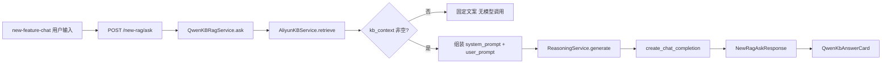

# 当前提示词与 RAG 调用链路审计文档

> **审计日期**：以仓库当前快照为准。  
> **说明**：本文档仅描述现状，不包含任何代码或提示词修改。  
> **业务前提（分析基准）**：下文「与业务目标的差距」一节将以下述前提逐条对照代码行为。

**业务前提（写入文档供对照）**

1. 数据源只能来自阿里云百炼知识库。  
2. 用户提问后，需要调用大模型识别问题中的关键词。  
3. 根据关键词去知识库检索法律法条切片。  
4. 检索到的内容是一组法律切片，切片结构包含：`【来源信息】…`、`【章节】…`、`【法规正文】…`（含法规名、类型、时效性、日期、链接等字段的可读拼接）。  
5. 模型最终回答只能基于检索到的知识库切片。  
6. 不能从外部获取法律信息。  
7. 检索时应只使用「时效性=有效」的法条。  
8. 最终回答中需要呈现引用法条的：法规名称、条文或章节、时效性、公布日期、生效日期、链接。  
9. 当前阶段先不要改最终回答模板，先只做现状审计。

---

## 1. 审计范围

### 1.1 指定路径扫描结果

| 路径 | 是否存在 | 作用摘要 |
|------|----------|----------|
| `new_feature_qwen_kb/service.py` | 是 | `QwenKBRagService`：调用 `AliyunKBService.retrieve`，组装 `system_prompt` / `user_prompt`，经 `ReasoningService.generate` 生成回答。 |
| `new_feature_qwen_kb/router.py` | 是 | FastAPI：`POST /new-rag/ask`，请求体 `NewRagAskRequest.question`，返回 `NewRagAskResponse`（含 `answer`、`citations`、`retrieved_count`、`model`）。当前文件**未**包含 `/new-rag/local-prompt` 等其它路由。 |
| `services/reasoning_service.py` | 是 | `ReasoningService.generate` → `create_chat_completion`；`ping` 使用独立探测用短 prompt。 |
| `services/aliyun_kb_service.py` | 是 | 百炼 `RetrieveRequest` 封装；解析 `Nodes` → `context` 字符串 + `citations` 列表；`rerank_top_n` 控制参与拼接的节点数量上限。 |
| `config/dashscope_config.py` | 是 | `create_chat_completion`：将 `system_prompt`（可选）与 `user_prompt` 组装为 `messages`，经 OpenAI 兼容 `responses.create` 调用 DashScope。 |
| `frontend/src/app/new-feature-chat/page.tsx` | 是 | 浏览器 `fetch` → `POST ${API}/new-rag/ask`；解析响应并调用 `normalizeAnswer` / `normalizeSources`，渲染 `QwenKbAnswerCard`。 |
| `frontend/src/components/chat/QwenKbAnswerCard.tsx` | 是 | 展示结论、分段详情、「知识库来源」列表（编号、相关度、文本）。 |
| `.env.example` | 是 | DashScope、百炼 AK/SK、`BAILIAN_WORKSPACE_ID`、`BAILIAN_INDEX_ID`、`BAILIAN_TIMEOUT_SECONDS` 等；**未**列出代码中使用的 `BAILIAN_RERANK_TOP_N`（代码内有默认值）。 |
| `README.md` | 是 | 描述 `/new-rag/ask` 链路、依赖环境变量与启动方式。 |
| `requirements.txt` | 是 | Python 依赖锁定（含 `openai`、`alibabacloud_*` 等由其它模块使用；本文件未逐条解释 RAG）。 |

### 1.2 全局关键词扫描（补充定位）

在 **`Legal_AI_Zhong/`** 下对 `prompt`、`system_prompt`、`retrieve`、`知识库`、`法条`、`时效性`、`来源` 等检索时，除上述核心文件外，**与「入库切片格式」强相关**的实现主要出现在 **`law_spider/法规爬虫4-清洗与知识库导出.py`**（生成含 `【来源信息】`、时效性等文本）及 **`law_spider/法规爬虫5-上传阿里云知识库.py`**（按 `【来源信息】` 锚点切分等）。**这些脚本不参与运行时 `/new-rag/ask` 的在线推理**，但说明知识库侧文档形态可能与业务假设的切片格式一致。

**未纳入本次「主链路」但存在模型与提示词逻辑的其它路径**：例如 `api/qa_api.py`、`agents/legal_qa_agent.py`（`/qa/ask` 法律问答）、`config/system_prompts.py`（若被其它模块引用）。当前 README 强调的新问答主入口为 **`/new-feature-chat` + `POST /new-rag/ask`**，故**下文第 2～7 节以该链路为主**；若后续优化提示词需统一 QA 与 new-rag，需单独再审计 `/qa` 链路。

---

## 2. 当前问答主链路

### 2.1 编号流程（new-rag）

1. **前端输入**：用户在 `frontend/src/app/new-feature-chat/page.tsx` 的 `textarea` 输入问题，触发 `send()`。  
2. **HTTP 请求**：`fetch(\`${getApiBaseUrl()}/new-rag/ask\`, { method: "POST", body: JSON.stringify({ question }) })`。  
3. **后端接口**：`new_feature_qwen_kb/router.py` 中 `ask_new_rag`，校验 `NewRagAskRequest`，实例化 `QwenKBRagService()` 并调用 `await svc.ask(req.question)`。  
4. **RAG 服务**：`new_feature_qwen_kb/service.py` 的 `QwenKBRagService.ask`：  
   - `kb_payload = await self.kb.retrieve(q)`，`self.kb` 为 `AliyunKBService`。  
   - 若 `kb_context` 为空：直接返回固定中文短句，**不再调用大模型**。  
   - 否则组装 `system_prompt`、`user_prompt`，调用 `await self.reasoning.generate(...)`。  
5. **推理层**：`services/reasoning_service.py` 的 `ReasoningService.generate` → `config/dashscope_config.py` 的 `create_chat_completion`。  
6. **模型调用**：`create_chat_completion` 构造 `messages`（见第 3 节），同步逻辑在线程池中执行 OpenAI 兼容 API。  
7. **返回前端**：`NewRagAskResponse`：`question`、`answer`、`model`、`retrieved_count`、`citations`（字典列表）。  
8. **前端展示**：`normalizeAnswer(data.answer)` 得到 `QwenAnswer`；`normalizeSources(data.citations)` 得到 `QwenKbSource[]`；`QwenKbAnswerCard` 渲染。

### 2.2 流程图（Mermaid）



---

## 3. 当前模型调用 messages 结构

### 3.1 构造位置与逻辑

- **入口**：`services/reasoning_service.py` → `ReasoningService.generate(*, system_prompt, user_prompt, model)`。  
- **实现**：`config/dashscope_config.py` → `async def create_chat_completion(...)`。

### 3.2 role 组成

| role | 是否包含 | content 来源 |
|------|----------|--------------|
| **system** | **当且仅当** `system_prompt` 为非空真值时包含 | 调用方传入的字符串；在 `QwenKBRagService.ask` 中为硬编码的 `system_prompt`（见第 4 节全文）。 |
| **user** | **始终包含** | 调用方传入的 `user_prompt`；在 new-rag 中为「用户问题 + 知识库检索结果字符串 + 可引用来源列表」拼接而成。 |
| **assistant** | **不包含** | 当前链路为单次生成，无多轮 history。 |

### 3.3 伪代码摘录（与源码等价）

```python
# config/dashscope_config.py — create_chat_completion
messages = []
if system_prompt:
    messages.append({"role": "system", "content": system_prompt})
messages.append({"role": "user", "content": user_prompt})
# 传入 OpenAI 兼容 responses.create(..., input=messages)
```

### 3.4 检索结果与引用在 messages 中的位置

- **知识库检索结果**：进入 **user** 角色的 `user_prompt` 中段落「知识库检索结果：」下方；内容为 `AliyunKBService.retrieve` 返回的 `context`（见 `new_feature_qwen_kb/service.py` 变量 `kb_context`）。  
- **引用编号摘要**：同一 `user_prompt` 内「可引用来源：」下列表，由 `citations[:8]` 的 `law_name` 与 `article` 格式化为 `[n] 法规名（article）`；**完整切片正文已在 `kb_context` 中**，通过 `AliyunKBService._format_context` 将每个 node 的 `Text` 前缀为 `[n]` 拼接进 `snippets`。

---

## 4. 当前提示词全文

### 4.1 new-rag 回答生成（`QwenKBRagService.ask`）

**system_prompt（完整摘录，源码字符串）：**

```text
你是一名专业法律助手。你必须优先依据提供的知识库内容作答，不得编造法规。输出结构：1) 结论 2) 依据 3) 建议。若依据不足，明确告知“信息不足，建议人工复核”。
```

**user_prompt（结构说明 + 模板）：**

- 固定前缀与字段：  
  - `用户问题：{q}`  
  - `知识库检索结果：` + 换行 + `{kb_context}`  
  - `可引用来源：` + 换行 + `ref_lines` 拼接（最多 8 条：`[{idx}] {law_name}（{article}）`），若无则为 `- 无`  

其中 `{kb_context}` 来自 `AliyunKBService._format_context`，格式为：

```text
[阿里云知识库检索背景]
用户问题：{query}

召回片段（可引用编号）：
[{idx}] {node.Text}
...
```

### 4.2 检索为空时的「回答」（非模型生成）

`new_feature_qwen_kb/service.py` 在 `not kb_context` 时返回：

```text
知识库未检索到有效内容，请尝试更具体的问题。
```

### 4.3 其它相关 prompt（非 new-rag 主回答）

| 位置 | 内容摘要 |
|------|----------|
| `services/reasoning_service.py` → `ping` | `system_prompt="你是连通性探测助手。"`，`user_prompt="请只回复：ok"` |

### 4.4 小结：是否存在明确 system prompt？

**存在。** new-rag 主链路在 `QwenKBRagService.ask` 中设置了明确的 **`system_prompt`**（见 4.1），并由 `create_chat_completion` 映射为 **`messages` 中的 `system` role**。

---

## 5. 当前知识库检索逻辑

### 5.1 检索 query 如何生成

- **唯一来源**：`QwenKBRagService.ask` 中 `q = (question or "").strip()`，直接传入 `AliyunKBService.retrieve(q)`。  
- **结论**：**直接使用用户原问题**，无二次改写、无关键词抽取、无单独「关键词识别」模型调用步骤。

### 5.2 是否有关键词抽取 prompt

**否。** 在 `new_feature_qwen_kb` 与 `AliyunKBService.retrieve` 调用链中未发现 LLM 关键词抽取。

### 5.3 百炼 Retrieve 请求参数

- **实现**：`AliyunKBService.retrieve_index` → `bailian_models.RetrieveRequest(index_id=..., query=query, search_filters=search_filters)`。  
- **当前 `retrieve()` 调用**：`search_filters` 固定为 **`None`**（未传过滤条件）。  
- **top_k / 截断**：  
  - 代码使用 `self.rerank_top_n`（环境变量 **`BAILIAN_RERANK_TOP_N`**，默认 **`6`**），在 `_format_context` 中取 `nodes[: max(1, self.rerank_top_n)]`。  
  - 这是对 **返回节点列表的前 N 个** 的截断逻辑；**并非**在文档中显式声明独立的 `top_k` API 字段名（以 SDK 生成的 `RetrieveRequest` 为准）。  
- **rerank**：变量名为 `rerank_top_n`，表示「参与上下文拼接的节点数量上限」；**未发现**额外调用 DashScope rerank 服务或对 score 做阈值过滤的代码。  
- **score threshold**：**无**。`Score` 仅写入 citation、日志与前端可选展示。

### 5.4 是否过滤「时效性=有效」

**检索阶段：未过滤。** `search_filters` 未设置；`_node_to_citation` 将 `"status": "valid"` **硬编码**，**不读取**节点元数据中的真实时效性字段。

### 5.5 法律切片字段在检索层的处理

- **解析**：从百炼返回的每个 node 读取 **`Text`**（正文）与 **`Metadata`**（字典）。  
- **Metadata 用于 citation 的字段**：`title` / `hier_title` / `doc_name` → `law_name`；`doc_id` / `nid` / `_id` → `article`（代码里用作「条文/文档标识」展示名，**不等于**法条号语义）。  
- **未解析**：业务假设中的「时效性、公布日期、生效日期、链接」等 **未** 在 `AliyunKBService` 中拆成独立字段；若存在于 `Text` 字符串中，则 **随纯文本** 进入 `kb_context`。

---

## 6. 当前法律切片字段处理情况

**说明**：运行时 **`AliyunKBService`** 将切片视为 **`node["Text"]` + `node["Metadata"]`**；业务描述的「【来源信息】|【章节】|【法规正文】」格式主要来自 **爬虫导出侧**（`law_spider`），在线服务 **未按该模板做结构化解析**。

| 字段 | 当前是否解析 | 当前是否传给模型 | 当前是否返回前端 | 当前是否展示 |
|------|----------------|------------------|------------------|----------------|
| 法规名 | **部分**：来自 Metadata → `law_name`（citation）；正文内若重复出现则随 `Text` | **是**（`kb_context` 含全文 `Text`；user 中「可引用来源」含法规名） | **是**（`citations[].law_name`） | **是**（来源卡片 fallback：`law_name · article`） |
| 类型 | **否**（无单独字段） | **仅当**存在于 `Text` 字符串中 | **否**（citations 无） | **否** |
| 时效性 | **否**（citation 固定 `"status": "valid"`） | **仅当**存在于 `Text` 字符串中 | **否**（未区分真实时效性） | **否** |
| 公布日期 | **否** | **仅当**在 `Text` 中 | **否** | **否** |
| 生效日期 | **否** | **仅当**在 `Text` 中 | **否** | **否** |
| 链接 | **否** | **仅当**在 `Text` 中 | **否**（citations 无 URL 字段） | **否** |
| 章节/条文 | **否**（未结构化）；`article` 字段实为 doc id | **是**（含于 `Text`；摘要行用 `article` 占位） | **是**（`citations[].article`） | **部分**（作为来源摘要的一部分） |
| 法规正文 | **否**（整段 `Text`） | **是** | **否**（API citations **不含** `text` 字段） | **部分**（若后端扩展字段则前端类型可选带 `text`；当前后端未返回则 UI 用标题拼接代替） |

### 6.1 citations / sources / nodes（后端）

- **`nodes`**：`AliyunKBService.retrieve` 返回原始 `Data.Nodes` 列表（调用方可用于调试；**未**传给前端）。  
- **`citations`**：由 `_node_to_citation` 生成，字段包括：`ref_id`、`law_name`、`article`、`status`（固定 valid）、`status_display`、`score`、`verified`、`verify_source`。  
- **`context`**：拼接后的单一字符串，供模型使用。

### 6.2 前端 `NewRagResponse.citations` 与展示

- 前端类型允许 `text?: string`，但 **当前后端 citation 字典不包含 `text`**，故 `normalizeSources` 常走 fallback：`law_name` 与 `article` 拼接或占位「暂无片段文本」。  
- **`QwenKbAnswerCard`** 展示：`[{id}]`、可选 `score`、以及一段 `source.text`（粗体 line-clamp）。

---

## 7. 当前引用展示情况

### 7.1 模型回答文本

- **约束**：`system_prompt` 要求输出「1) 结论 2) 依据 3) 建议」，**未强制**在答案中列出法规全称、链接、时效性、日期或 `[n]` 编号。  
- **用户 prompt** 提供「可引用来源」列表（含 `[n]` 与法规名、article），属于 **软提示**，无「必须在结论中引用编号」的硬性句式。

### 7.2 前端 UI

- **结构调整**：`normalizeAnswer` 按编号段落尝试拆分结论与详情（正则 `\d+\s*[).、：]`），**不是**后端模板，而是前端展示解析。  
- **引用列表**：独立区块「知识库来源」，数据来自 **`citations`**，**不是**从模型回答中再抽取链接或时效性。  
- **结论**：引用呈现 **以前端 citations 区块为主**；模型正文是否含法规名、链接、时效性 **依赖模型自觉**，**无代码强制**。

---

## 8. 与业务目标的差距

| 业务要求 | 当前是否满足 | 证据位置 | 风险 | 后续优化建议（方向） |
|----------|----------------|----------|------|----------------------|
| 只能使用知识库 | **部分** | `system_prompt`：「优先依据」「不得编造法规」；无「禁止使用训练知识」的更强约束 | 模型仍可能补充训练数据中的法律常识 | 强化 system/user 约束与「无检索则拒答」策略 |
| 先识别关键词再检索 | **否** | `QwenKBRagService.ask` 直接用 `question` 调用 `retrieve(q)` | 长尾问句、口语化问法召回差 | 增加关键词/检索 query 生成（可用独立 prompt 或规则） |
| 只检索时效性为有效的法条 | **否** | `retrieve` 未传 `search_filters`；`status` 硬编码 `valid` | 废止法规仍可能入库并被召回；展示层误以为「有效」 | 检索过滤与元数据字段对齐；citation 反映真实状态 |
| 回答必须引用法规名 | **部分** | 仅 user 中「可引用来源」列表；无强制输出格式 | 模型可能不写法规名 | 输出格式约束 + 校验 |
| 回答必须引用链接 | **否** | citations 无 URL；prompt 未要求 | 用户无法从答案直达权威出处 | 元数据扩展 + prompt + UI |
| 回答必须说明时效性 | **否** | 未解析时效性；未要求模型输出 | 合规风险 | 结构化字段 + prompt |
| 回答不得使用外部法律信息 | **部分** | 仅有「不得编造法规」类表述 | 边界模糊 | 明确「仅允许使用用户消息中的检索块」 |
| 回答不得编造法条 | **部分** | 同上 | 仍存在捏造编号风险 | 强制 `[n]` 对齐检索片段 |
| 检索不到时要说明知识库未找到 | **部分** | 空 `kb_context` 返回固定句；**未区分**「库中无」与「有相关但未命中」 | 用户感知不精确 | 分层文案与阈值策略 |

---

## 9. 当前提示词主要问题总结

1. **检索 query 等于原始用户问题**，无关键词抽取或与业务一致的「先理解再检索」步骤，召回质量依赖用户措辞。  
2. **无检索过滤**（含时效性、文档类型），且 citation 中 **`status` 恒为 `valid`**，易与真实法律效力脱节。  
3. **system prompt 约束偏软**：「优先依据」不等于「仅允许依据」；未明确禁止利用模型内置法律知识作答。  
4. **未强制引用格式**：未要求答案必须带 `[n]`、法规名、链接、时效性、日期等，易出现「看似正确但不可溯源」的表述。  
5. **未区分失败类型**：空上下文一句带过；无法区分「知识库无相关内容」与「API 异常」「score 过低」等（后者当前也未定义阈值）。  
6. **user_prompt 中「知识库检索结果」与「可引用来源」信息冗余**：若模型忽略编号对齐，仍可能编造条文。  
7. **前端引用展示依赖 citations**：后端 citation **无正文、无链接**，前端常以标题拼接代替片段，**与用户要求的引用字段差距大**。  
8. **无 assistant 多轮**：当前单次调用无法做「检索—判断不足—改写 query 再检索」闭环（若业务需要需架构层支持）。

---

## 10. 后续提示词优化建议方向

1. **关键词识别提示词**：单独一步 LLM 或轻量规则，将用户问题转为「检索 query + 同义词/条目标签」，并记录进日志便于调参。  
2. **知识库检索 query 生成提示词**：与关键词步骤合并或拆分；可输出结构化 JSON（主查询、备用查询、过滤意图）。  
3. **回答生成 system prompt**：改为「仅允许使用下方检索块中的事实」「禁止引用检索块未出现的条文编号」「必须列出引用编号与法规名称」等可验证规则。  
4. **引用约束**：强制 `[n]` 与检索片段一一对应；法规名、章节、链接、时效性字段从元数据注入 user 段而非仅靠正文。  
5. **时效性约束**：检索侧过滤 + prompt 声明「若片段时效性非有效须标注不可用」+ citation 展示真实状态。  
6. **不使用外部知识约束**：明确「凡检索块未覆盖的法律命题一律回答信息不足」；可对高风险意图加模板拒答。  
7. **检索不足策略**：根据 `nodes` 数量、`score`、重复度分级返回不同系统提示与用户可见文案；必要时自动触发二次检索（prompt 改写）。

---

## 附录 A：环境变量与默认值（与 RAG 相关）

| 变量 | 用途 | 备注 |
|------|------|------|
| `NEW_QWEN_MODEL_NAME` | new-rag 生成模型 | 缺省回落 `REASONING_MODEL_NAME` → 代码默认 `qwen-plus` |
| `REASONING_MODEL_NAME` | `ReasoningService` 默认模型 | `.env.example` 示例为 `qwen-plus` |
| `REASONING_TEMPERATURE` | 生成温度 | 默认 `0.3` |
| `DASHSCOPE_API_KEY` / `DASHSCOPE_BASE_URL` | 模型调用 | 必填 API Key |
| `BAILIAN_*` / `ALIBABA_CLOUD_*` | 百炼 Retrieve | 见 `.env.example` |
| `BAILIAN_RERANK_TOP_N` | 参与拼接的节点数上限 | **仅代码默认值 6**；`.env.example` 未列出 |

---

## 附录 B：接口返回结构（`POST /new-rag/ask`）

- **Pydantic 模型**：`NewRagAskResponse`（`new_feature_qwen_kb/router.py`）。  
- **字段**：`question: str`、`answer: str`、`model: str`、`retrieved_count: int`、`citations: List[Dict[str, Any]]`。  
- **citations 单条典型键**：`ref_id`、`law_name`、`article`、`status`、`status_display`、`score`、`verified`、`verify_source`（以 `AliyunKBService._node_to_citation` 为准）。

---

*文档结束。*
